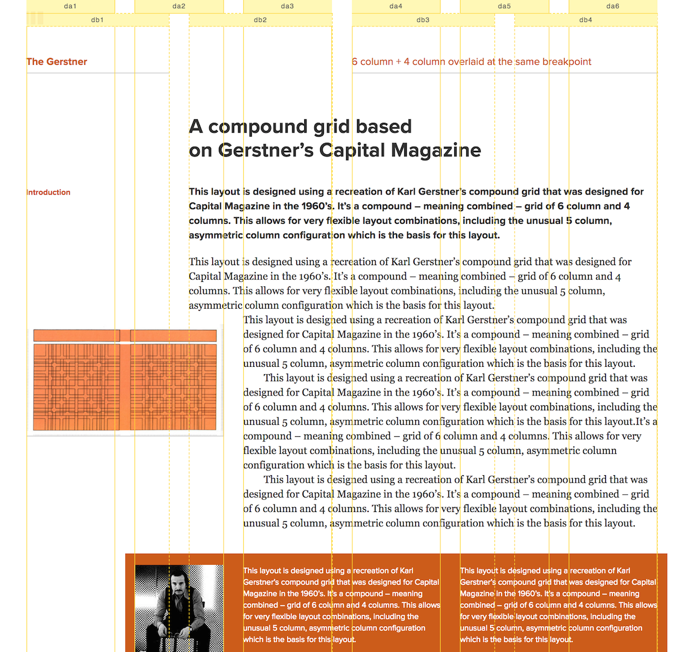
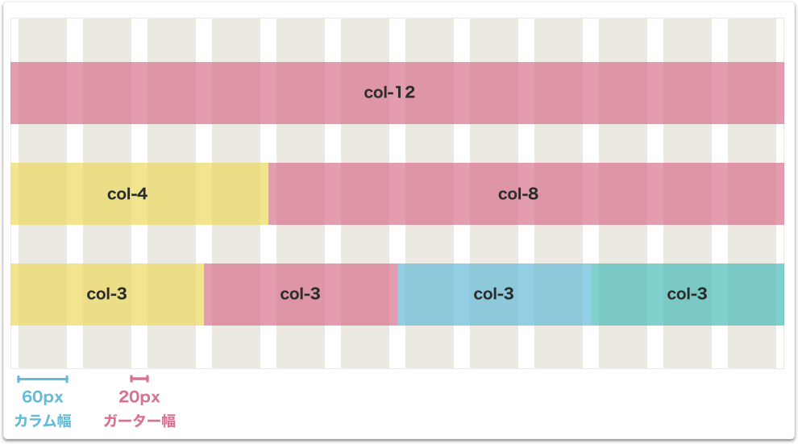
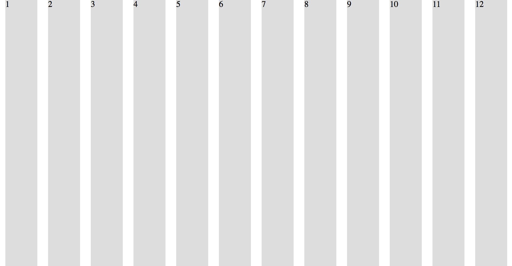

# グリッドレイアウト

## 目的

- グリッドレイアウトについて学ぶ
- 自分でグリッドが作れるようになる

## グリッドレイアウトとは

グリッドレイアウトは元々紙のデザインにおいて使われていた手法です。古いブラウザではHTMLテーブルを利用してレイアウトをデザインしていたため、このグリッドレイアウトは採用されていませんでしたが、ブラウザの進化とCSSの進化に伴いWebデザインにこの方法が適用され始め、現在メジャーなデザイン手法となっています。

以下はGridset Appというアプリを提供する企業のサイト内で公開されているGridレイアウトの事例です。

[Gridset App内の事例1](https://gridsetapp.com/specs/fonmon/?gridset=show)


画像の例ではページは6カラムと4カラムを組み合わせたグリッドレイアウトの例です。このようにグリッドを使って文章の横軸での位置を揃えることで読みやすい構成のウェブサイトを作ることができます。

## 実際にデザインしてみよう

実際のウェブサイト制作では、上記のように複雑なものではなく、例えば12カラムのグリッドを1個だけ定義して使うのが普通です。なぜ12カラムかというと、12は2、3、4、6の４つの数字で割り切ることが出来、様々なレイアウトを表現し易いためです。

### 1. 横幅、カラム幅、ガーター幅を決める。

グリッドレイアウトでは元々、960gsという有名なツールがあったこともあり以前は960pxの最大横幅を取るサイトがよくありました。今回はこの960pxの横幅でグリッドレイアウト用のCSSを定義していきます。このグリッドレイアウトを適用するセクションには一般的に`container`というクラス属性を利用します。

```css
.container {
  width: 960px;
  margin: 0 auto;
}
```

### 2. カラム幅とガーター幅を決める

グリッドレイアウトではメインコンテンツの入る部分をカラム、カラムの間の隙間をガーターと呼びます。ガーターはボーリングのガーターと一緒ですね。
それぞれのカラムの左右に隙間があるため、一つのガーターはその隙間2つ分です。この隙間をCSS上ではPaddingを使って表します。

今回はカラム幅は`60px`、ガーター幅`20px`としてCSSでグリッドを定義していきましょう。



### 3. カラムをCSSで定義する。

最初に、12のカラムを持つサイトを作ってみましょう。

```css
/* Grid */
.container {
  width: 960px;
  margin: 0 auto;
}

.column {
  width: 80px;
  padding: 0 10px;
}

/* その他 */
.ex-column {
  min-height: 500px;
  background-color: #ddd
}
```

```html
<section class="container">
  <div class="column"><div class=" ex-column">1</div></div>
  <div class="column"><div class=" ex-column">2</div></div>
  <div class="column"><div class=" ex-column">3</div></div>
  <div class="column"><div class=" ex-column">4</div></div>
  <div class="column"><div class=" ex-column">5</div></div>
  <div class="column"><div class=" ex-column">6</div></div>
  <div class="column"><div class=" ex-column">7</div></div>
  <div class="column"><div class=" ex-column">8</div></div>
  <div class="column"><div class=" ex-column">9</div></div>
  <div class="column"><div class=" ex-column">10</div></div>
  <div class="column"><div class=" ex-column">11</div></div>
  <div class="column"><div class=" ex-column">12</div></div>
</section>
```

これをブラウザで見ると以下の画像のようになります。



[サンプルコード](https://github.com/codegrit-jp-students/codegrit-html-css-lesson07-sample-columns)

### 4. カラム数が2つ以上のときの定義をする。

１カラムの時と同様に2つ以上のカラムのときの定義をします。

```css
.container {
  width: 960px;
  margin: 0 auto;
  display: flex;
}

.column-1 {
  width: 80px;
  padding: 0 10px;
}
.column-2 {
  width: 160px;
  padding: 0 10px;
}
.column-3 {
  width: 240px;
  padding: 0 10px;
}
.column-4 {
  width: 320px;
  padding: 0 10px;
}
.column-5 {
  width: 400px;
  padding: 0 10px;
}
.column-6 {
  width: 480px;
  padding: 0 10px;
}
.column-7 {
  width: 560px;
  padding: 0 10px;
}
.column-8 {
  width: 640px;
  padding: 0 10px;
}
.column-9 {
  width: 720px;
  padding: 0 10px;
}
.column-10 {
  width: 800px;
  padding: 0 10px;
}
.column-11 {
  width: 880px;
  padding: 0 10px;
}
.column-12 {
  width: 960px;
  padding: 0 10px;
}
```

```html
<section class="container">
  <div class="column-3">
    <div class="ex-column">サイド</div>
  </div>
  <div class="column-9">
    <div class="ex-column">メイン</div>
  </div>
</section>
```


[サンプルコード](https://github.com/codegrit-jp-students/codegrit-html-css-lesson07-sample-basic-grid)

### 5. Flexboxを活用する

まず最初に.containerの`width:960px`を`max-width:960px;`へと変更します。また、それぞれのカラムの`width`をパーセンテージに変えます。例えば1カラムであれば`80px`なので、

(80px / 960px) * 100 = 8.33(%)

となります。同じように全てのカラムで計算すると以下のようになります。

```css
/* Grid */
.container {
  max-width: 960px;
  margin: 0 auto;
  display: flex;
}

.column-1 {
  width: 8.33%;
  padding: 0 10px;
}
.column-2 {
  width: 16.67%;
  padding: 0 10px;
}
.column-3 {
  width: 25%;
  padding: 0 10px;
}
.column-4 {
  width: 33.33%;
  padding: 0 10px;
}
.column-5 {
  width: 41.67%;
  padding: 0 10px;
}
.column-6 {
  width: 50%;
  padding: 0 10px;
}
.column-7 {
  width: 58.33%;
  padding: 0 10px;
}
.column-8 {
  width: 66.67%;
  padding: 0 10px;
}
.column-9 {
  width: 75%;
  padding: 0 10px;
}
.column-10 {
  width: 83.33%;
  padding: 0 10px;
}
.column-11 {
  width: 91.67%;
  padding: 0 10px;
}
.column-12 {
  width: 100%;
  padding: 0 10px;
}
```

[サンプルコード](https://github.com/codegrit-jp-students/codegrit-html-css-lesson07-sample-flex-grid)

## チャレンジ

[チャレンジ7](./challenge/README.md)

## 更に学ぼう

記事で学ぶ:

- [Grids - MDN](https://developer.mozilla.org/en-US/docs/Learn/CSS/CSS_layout/Grids)
- [15 Reasons Why A Grid Based Approach Will Improve Your Designs](https://www.canva.com/learn/grid-design/)
