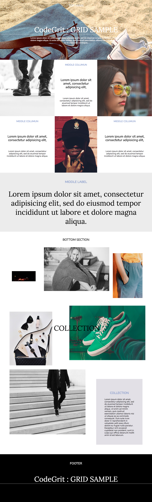

# チャレンジ7

```
所要時間: 1時間〜2時間
ステータス: 公開
タイプ: 課題
```

## 目的

- グリッドの仕組みを理解し、実践的な使用方法ができるようになる。
- 基本的なグリッドで、まずはレスポンシブデザインのデスクトップ端末の調整ができるようになる。

## チャレンジの取り組み方

1. マイルストーンごとに要件に合うようにファイルを編集していきます。
2. 分からない部分があれば、テキストを復習して、再度チャレンジしてみましょう。
3. 再チャレンジしてしばらく考えても分からない場合はチャットでメンターに質問しましょう。
4. 完成したら、Dropboxでメンターとファイルを共有して下さい。
5. メンターから課題レビューが届きます。
6. ビデオチャットの際は、分からない点を更に突っ込んで聞いたり、より良い書き方を聞いてみましょう。

## 概要

以下の完成イメージと同じになるよう、グリッドや今まで習ってきたことを使用してWebページを作成してみましょう。

**完成イメージ**



## スターターファイル

以下のURLのコードをテンプレートとして利用して下さい。

- [codegrit-html-css-ch07-starter](https://github.com/codegrit-jp-students/codegrit-html-css-ch07-starter)

## マイルストーン

### 要件

- スターターファイルと画像を編集して、完成イメージに近いWebページを作成して下さい。
- 画像へのパスは必要に応じて変更して下さい。
- columnの設定にはflexboxを利用し、widthを指定してください。

## 評価

課題の後、以下の２つについてメンターにフィードバックをお願いします。

1. 要件のカバー度: 1.全く出来なかった 2.ほとんど出来なかった 3. 半分ほどは出来た 4.8割ほどは出来た 5. 全部出来た
2. 難易度: 1. とても難しかった 2. 難しかった 3. ちょうど良かった 4. 簡単だった 5. とても簡単だった
