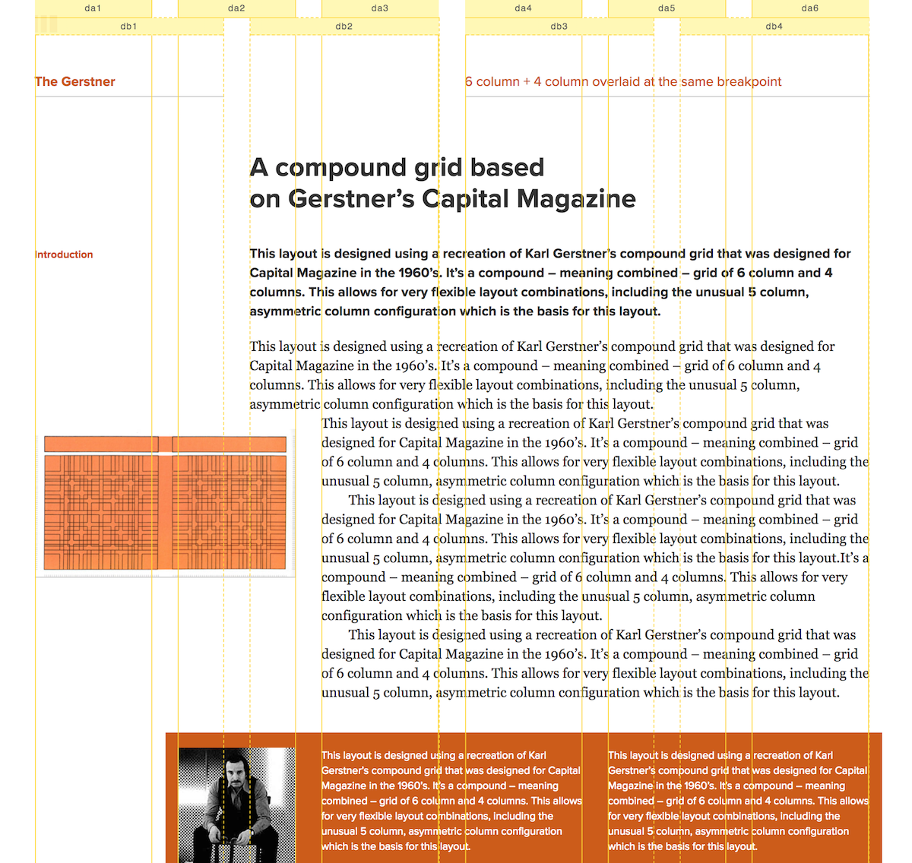
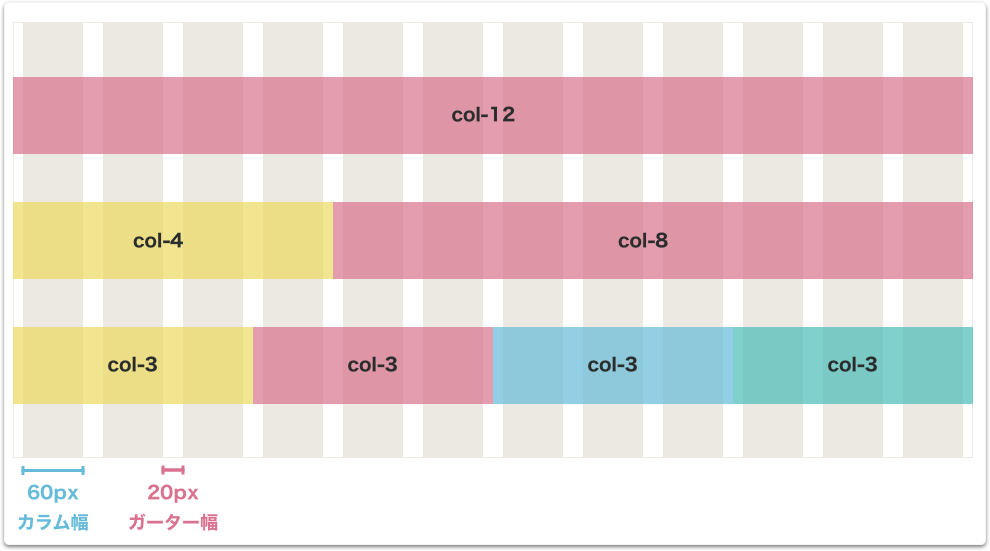
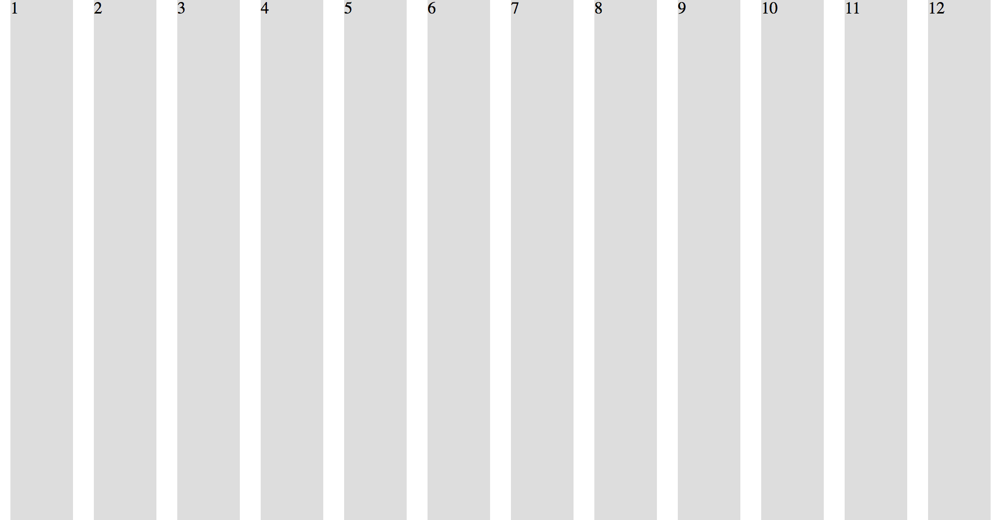
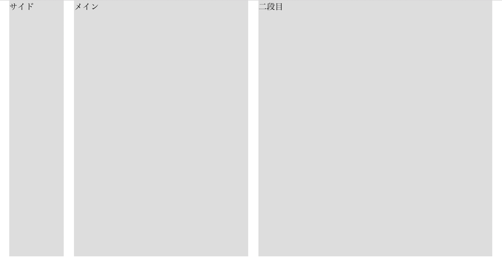
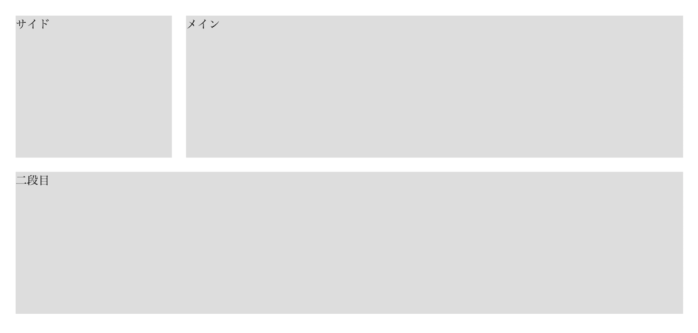
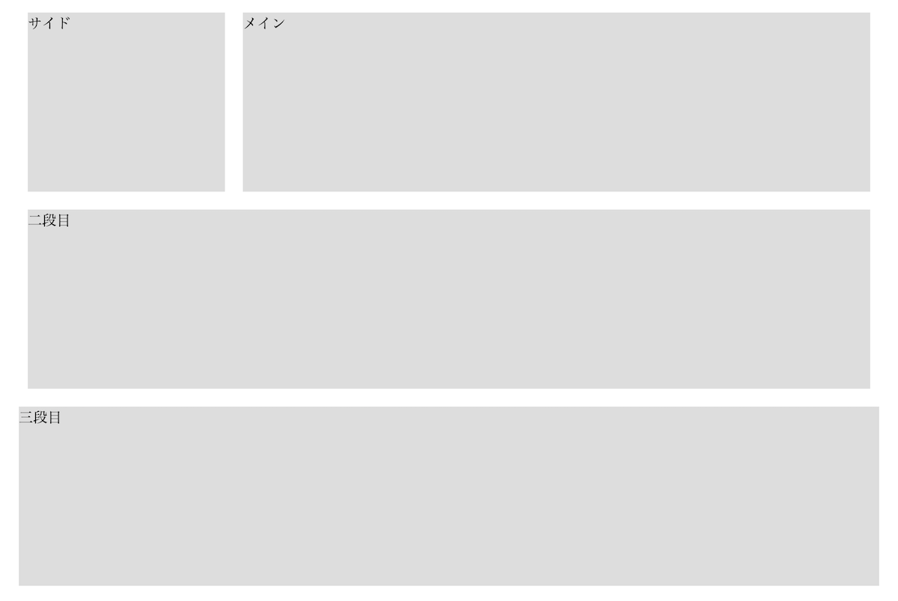
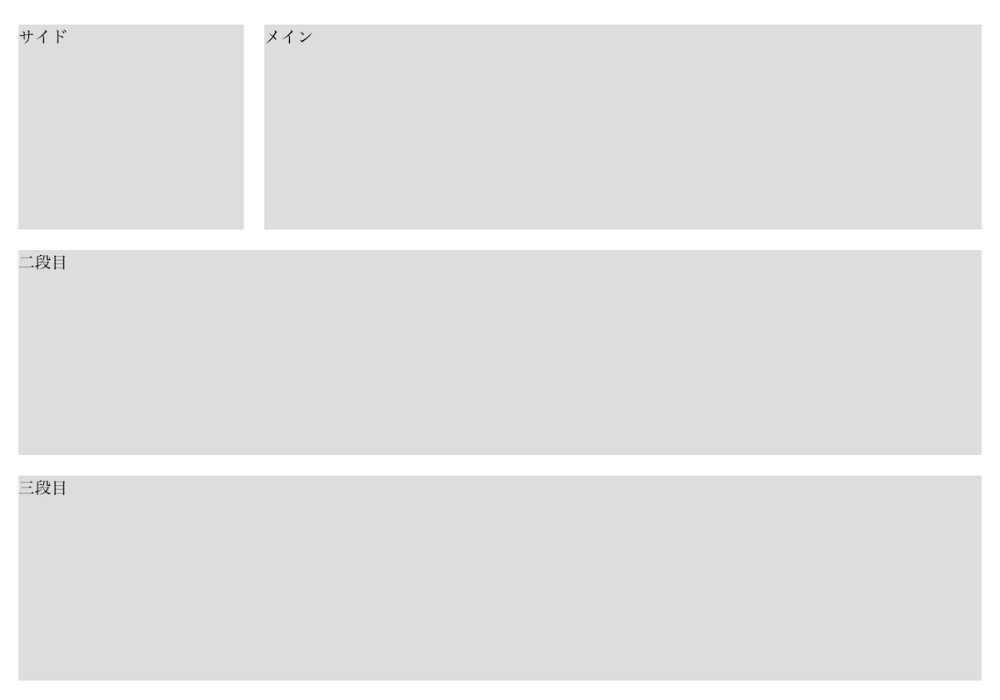
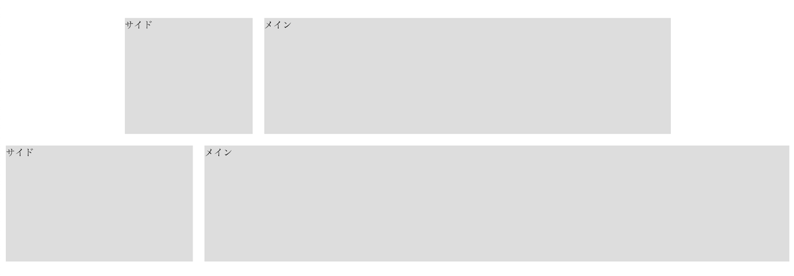

## グリッドレイアウトとは

グリッドレイアウトは元々紙のデザインにおいて使われていた手法です。古いブラウザではHTMLテーブルを利用してレイアウトをデザインしていたため、このグリッドレイアウトは採用されていませんでしたが、ブラウザの進化とCSSの進化に伴いWebデザインにこの方法が適用され始め、現在メジャーなデザイン手法となっています。

以下はGridset Appというアプリを提供する企業のサイト内で公開されているGridレイアウトの事例です。

[Gridset App内の事例1](https://gridsetapp.com/specs/fonmon/?gridset=show)


## グリッドを使うべき理由

Webデザインにおいてなぜグリッドを使用するのがよいのでしょうか？ これにはいくつか理由があります。

### デザインが統一される。

グリッドレイアウトを利用すると、文章やタイトルの開始位置を揃えることが行いやすくなります。開始位置を揃えることによってサイトの可読性が高まります。

### デザインが早く出来る

グリッドの考え方は、普段からウェブデザインを行う人の間では共通の概念として利用出来ます。そのため、他のWeb制作者と一緒に仕事をする上でもお互いのデザインの意図をコードから伝えやすくなります。またグリッドの考え方を常にWebデザインで適用すれば一からレイアウトを考えて設定するよりも早く正確にデザインが出来ます。

## 単純なグリッドレイアウトを実装する。

実際のウェブサイト制作では、先ほどの事例のように複雑なものではなく、例えば12カラムのグリッドを1個だけ定義して使うのが普通です。なぜ12カラムかというと、12は2、3、4、6の４つの数字で割り切ることが出来、様々なレイアウトを表現し易いためです。

### 1. 横幅を決める。

グリッドレイアウトでは元々、960gsという有名なツールがあったこともあり以前は960pxの最大横幅を取るサイトがよくありました。今回はこの960pxの横幅でグリッドレイアウト用のCSSを定義していきます。このグリッドレイアウトを適用するセクションには一般的に`container`というクラス属性を利用します。また`container`以下に配置するカラムが横並びになるように`container`をFlexコンテナーにします。

```css
* {
  box-sizing: border-box;
}

.container {
  width: 960px;
  margin: 0 auto;
  display: flex;
}
```

### 2. カラム幅とガーター幅を決める

グリッドレイアウトではメインコンテンツの入る部分をカラム、カラムの間の隙間をガーターと呼びます。ガーターはボーリングのガーターと一緒ですね。
それぞれのカラムの左右に隙間があるため、一つのガーターはその隙間2つ分です。この隙間をCSS上ではPaddingを使って表します。

今回はカラム幅は`60px`、ガーター幅`20px`としてCSSでグリッドを定義していきましょう。



### 3. カラムをCSSで定義する。

最初に、12のカラムを持つサイトを作ってみましょう。ガーター幅`20px`はカラムに対してpaddingを左右に10pxずつ入れることで実現出来ます。

今回は、columnというクラスを定義しています。そこにカラム幅とガーター幅を合わせた`80px`を横幅として設定しています。また、`box-sizing: border-box;`を忘れずに設定してください。

```css
* {
  box-sizing: border-box;
}

/* Grid */
.container {
  width: 960px;
  margin: 0 auto; /* コンテナーが横幅全体の中央に表示されるようにする。 */
  display: flex;
}

.column {
  width: 80px; /* カラム幅60px + ガーター幅20px */
  padding: 0 10px; /* ガーター幅20px */
}

/* その他 */
.ex-column {
  min-height: 500px;
  background-color: #ddd;
  margin-bottom: 20px;
}
```

```html
<section class="container">
  <div class="column"><div class="ex-column">1</div></div>
  <div class="column"><div class="ex-column">2</div></div>
  <div class="column"><div class="ex-column">3</div></div>
  <div class="column"><div class="ex-column">4</div></div>
  <div class="column"><div class="ex-column">5</div></div>
  <div class="column"><div class="ex-column">6</div></div>
  <div class="column"><div class="ex-column">7</div></div>
  <div class="column"><div class="ex-column">8</div></div>
  <div class="column"><div class="ex-column">9</div></div>
  <div class="column"><div class="ex-column">10</div></div>
  <div class="column"><div class="ex-column">11</div></div>
  <div class="column"><div class="ex-column">12</div></div>
</section>
```

これをブラウザで見ると以下の画像のようになります。



[サンプルコード](https://github.com/codegrit-jp-students/codegrit-html-css-lesson07-sample-columns)

## 様々なレイアウトに対応可能にする。

さて先ほど、非常に単純なグリッドレイアウトを定義しましたが12分の1のカラムしかない状態では複雑なレイアウトは行えません。そこで、様々なカラム幅に対応出来るようにしていきます。

そのためには、例えば`.column-2`のときは横幅160px、`.column-3`なら横幅240pxという風にして、1/12のカラム幅80pxの倍数で、12のクラスを順番に設定していきます。

### 1. カラム数が2つ以上のときの定義をする。

１カラムの時と同様に2つ以上のカラムのときの定義をします。

```css
* {
  box-sizing: border-box;
}

.container {
  width: 960px;
  margin: 0 auto;
  display: flex;
}

.column-1 {
  width: 80px;
  padding: 0 10px;
}
.column-2 {
  width: 160px;
  padding: 0 10px;
}
.column-3 {
  width: 240px;
  padding: 0 10px;
}
.column-4 {
  width: 320px;
  padding: 0 10px;
}
.column-5 {
  width: 400px;
  padding: 0 10px;
}
.column-6 {
  width: 480px;
  padding: 0 10px;
}
.column-7 {
  width: 560px;
  padding: 0 10px;
}
.column-8 {
  width: 640px;
  padding: 0 10px;
}
.column-9 {
  width: 720px;
  padding: 0 10px;
}
.column-10 {
  width: 800px;
  padding: 0 10px;
}
.column-11 {
  width: 880px;
  padding: 0 10px;
}
.column-12 {
  width: 960px;
  padding: 0 10px;
}
```

```html
<section class="container">
  <div class="column-3">
    <div class="ex-column">サイド</div>
  </div>
  <div class="column-9">
    <div class="ex-column">メイン</div>
  </div>
</section>
```


[サンプルコード](https://github.com/codegrit-jp-students/codegrit-html-css-lesson07-sample-basic-grid/tree/master/without-wrap)

### 2. 2段以上のグリッドレイアウトに対応させる。

実は、先ほどのHTMLとCSSの設計には問題があります。試しに、先ほどの例に更にもう一段12個のカラム幅を持つ要素を加えてみましょう。

```html
<section class="container">
  <div class="column-3">
    <div class="ex-column">サイド</div>
  </div>
  <div class="column-9">
    <div class="ex-column">メイン</div>
  </div>
  <div class="column-12">
    <div class="ex-column">二段目</div>
  </div>
</section>
```

すると以下の画像のようになってしまいます。



これは、現状だと`display: flex`のみがコンテナーに設定されているため、その下のカラムが増えたときにコンテナー内でアイテム(カラム)が縮んで表示されてしまうからです。

これを回避するためには、コンテナーに`flex-wrap: wrap`を設定してあげて、横幅の960pxを超えた部分が下の段に来るようにします。

```css
.container {
  max-width: 960px;
  margin: 0 auto;
  display: flex;
  flex-wrap: wrap;
}
```

これで、2段のレイアウトが表示されるようになりました。




### 3. rowクラスを導入して、横幅のずれを調整する。

さて、ここまででほぼグリッドレイアウトのためのCSSデザインは完了してきました。しかし、まだもう一つ問題があります。それを確認するために、グリッドを適用せずに、横幅100%を適用した3段目を追加してみましょう。

```html
<section class="container">
  <div class="column-3">
    <div class="ex-column">サイド</div>
  </div>
  <div class="column-9">
    <div class="ex-column">メイン</div>
  </div>
  <div class="column-12">
    <div class="ex-column">二段目</div>
  </div>
  <div class="width-100">
    <div class="ex-column">三段目</div>
  </div>
</section>
```

```css
...省略
.width-100 {
  width: 100%;
}
```

変更してから再度画面を確認すると以下の画像のように表示されます。



ご覧の通り、2段目のグレー部分の幅と、3段目のグレー部分の幅でズレが生じていることが分かるはずです。これはグリッドを利用している場合ガーター幅の分左右10pxずつpaddingが入っているためです。

すべての部分にグリッドを適用するのであれば現状のままでも良いのですが、それは少し面倒です。そこでこのガーター部分のズレを解消しましょう。そのためには、以下のようにします。

1. コンテナーの左右に`padding: 0 10px`を設定する。
2. `.row`クラスを定義し、`margin: 0 -10px`を設定して、コンテナーの左右の空白を無くす。
3. コンテナーの下に`.row`を入れ、その下にカラムを配置する。
4. カラムがFlexアイテムとして表示されるように、`display: flex`をコンテナーからrowへと移動する。

これを実際に書くと以下のようになります。

```css
.container {
  max-width: 960px;
  margin: 0 auto;
  padding: 0 10px;
}

.row {
  display: flex;
  flex-wrap: wrap;
  margin: 0 -10px;
}
```

```html
<section class="container">
  <div class="row">
    <div class="column-3">
      <div class="ex-column">サイド</div>
    </div>
    <div class="column-9">
      <div class="ex-column">メイン</div>
    </div>
  </div>
  <div class="row">
    <div class="column-12">
      <div class="ex-column">二段目</div>
    </div>
  </div>
  <div class="width-100">
    <div class="ex-column">三段目</div>
  </div>
</section>
```

ブラウザを更新してみましょう。三段すべてが揃っていることが確認出来るはずです。



[サンプルコード](https://github.com/codegrit-jp-students/codegrit-html-css-lesson07-sample-basic-grid/tree/master/with-row)


## 様々なコンテナー幅へ対応する。

さて、ここまででグリッドについてはデザイン出来ましたが、最後にもう一つ修正したいことがあります。それは様々なコンテナー幅への対応です。現状のCSSのデザインでは、コンテナー幅が960pxから変更された場合にすべてのカラムのクラスを変更する必要が出てきます。

これを解決するための手段として、各カラムの幅を`px`で決めるのではなく`%`で決めます。

例えば1カラムであれば`80px`なので、%へと変更すると。

(80px / 960px) * 100 = 8.33(%)

となります。同じように他のカラム幅も計算をして決めていくと最終的に以下のようになります。

```css
/* Grid */
.container {
  max-width: 960px;
  margin: 0 auto;
  padding: 0 10px;
}

.row {
  display: flex;
  flex-wrap: wrap;
  margin: 0 -10px;
}

.column-1 {
  width: 8.33%;
  padding: 0 10px;
}
.column-2 {
  width: 16.67%;
  padding: 0 10px;
}
.column-3 {
  width: 25%;
  padding: 0 10px;
}
.column-4 {
  width: 33.33%;
  padding: 0 10px;
}
.column-5 {
  width: 41.67%;
  padding: 0 10px;
}
.column-6 {
  width: 50%;
  padding: 0 10px;
}
.column-7 {
  width: 58.33%;
  padding: 0 10px;
}
.column-8 {
  width: 66.67%;
  padding: 0 10px;
}
.column-9 {
  width: 75%;
  padding: 0 10px;
}
.column-10 {
  width: 83.33%;
  padding: 0 10px;
}
.column-11 {
  width: 91.67%;
  padding: 0 10px;
}
.column-12 {
  width: 100%;
  padding: 0 10px;
}
```

これで、例えばcontainerの長さを変更したいときには以下のようにすることが出来ます。例えば、幅960pxではなくて、画面の横幅全体を取るコンテナーを設定してみます。

```css
.full-width-container {
  width: 100%;
  margin: 0 auto;
  padding: 0 10px;
}

...省略
``

```html

<body>
  <!-- 幅960pxのコンテナー -->
  <section class="container">
    <div class="row">
      <div class="column-3">
        <div class="ex-column">サイド</div>
      </div>
      <div class="column-9">
        <div class="ex-column">メイン</div>
      </div>
    </div>
  </section>

  <section class="full-width-container">
    <div class="row">
      <div class="column-3">
        <div class="ex-column">サイド</div>
      </div>
      <div class="column-9">
        <div class="ex-column">メイン</div>
      </div>
    </div>
  </section>
</body>

```

これで再度ページを更新すると、画面幅いっぱいに幅を取るグリッドが出来ているはずです。





[サンプルコード](https://github.com/codegrit-jp-students/codegrit-html-css-lesson07-sample-flex-grid)

## 更に学ぼう

記事で学ぶ:

- [Grids - MDN](https://developer.mozilla.org/en-US/docs/Learn/CSS/CSS_layout/Grids)
- [15 Reasons Why A Grid Based Approach Will Improve Your Designs](https://www.canva.com/learn/grid-design/)
